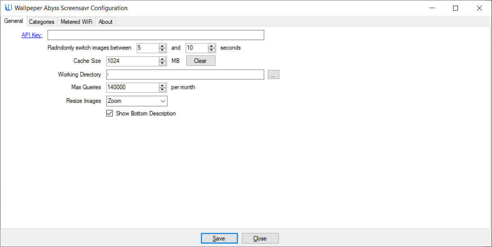

# WallpaperAbyss
A Screensaver that fetches and displays images from Alpha Coders Wallpaper Abyss.

When the screen saver is running you can use the arrow keys (Left & Right) to go back and forth between images. Just in case you saw something you liked. Any other key or mouse action closes the screensaver.

Requirements: A [Wallpaper Abyss API Key](https://wall.alphacoders.com/api.php)

Issues? Let me know! [Tyler](mailto:tyler@fromthe.blue)

# Limitations:

Sometimes the search items in the list get a bit confused when adding and removing search items in the "Categories" Tab of the config window.

There can be an unhealthy delay when the first pic is displayed. 

# Installation:
First download and build the Project (or download the latest version from the Release folder) and copy the four files into your "%SystemRoot%\SysWOW64" folder (Not the System32 folder as it'll just crap out there). 

ManagedWiFi.dll

WallpaperAbyss.scr

WallpaperAbyssApiV2.dll

WallpaperAbyssSettings.dll

Next go get a [Wallpaper Abyss API Key](https://wall.alphacoders.com/api.php) 

Next you need to open the screen saver settings window and setup your screen saver to be Wallpaper Abyss:

You may get an error like in the video complaining about the API key cannot be null. Just continue and put one in :)

# Setup:

## General Options

**API Key**: The Wallpaper Abyss API Key. You *need* this in order to access their API 

**Randomly Switch Between *x* and *y* seconds**: Controls how many seconds the image should change. When the screensaver is running it'll choose a random number of seconds between *x* and *y*

**Cache Size**: The number of MB to devote to saving images. A larger number means more images. I usually keep it about 1024 MB (1 gig).

**Working Directory**: The location on disk to save the images to.

**Max Queries**: The max number of queries the screen saver is aloud to use per month. The API is 150,000 queries per month so I keep a bit lower than that.

**Resize Images**: How should images be resized if they don't fit the screen?

**Show Bottom Description**: Display a black bar at the bottom of the screen that shows the Description, Category, and ID of the image

## Search Categories

**Search Methods Used**: A list of the search options / queries you want to fetch images for. This allows you to pick only terms and categories you want to show. Like "Nature" or "Abstract" or "Mountains with Snow"

### Search Options:

**Search By**: 

*Newest*: Returns the newest images

*Highest Rated*: Returns the images that are highest rated

*By Views*: Returns images with the most views

*By Favorites*: Returns the most favoured images

*Category*: Returns images in a specific category. Based on the item you select on the right-hand list.

*Collection*: Returns images in a specific collection.

*Group*: Returns images in a specific group. (I'm not sure what the diff between group and category is)

*Sub Category*: Subcategory lets you drill down a level from Category and choose something a little more specific. Like Category "Humor" but only show "Bill Murray"

*Featured*: Show images featured on Wallpaper Abyss

*Popular*: Show the most popular images

*User*: Show images based on username

*Search*: Lets you enter a search term to query images

*Random*: You got it. Yup. A random selection of who knows what. But nothing should be NSFW as AlphaCoders stipulates only family friendly images however there are a few in there that are pretty racy. 

**Sort By**:

*Newest*: Return results by age. Newest first

*Rating*: Return results with the highest rating

*Views*: Return results based on view count

*Favorites*: Return results by number of people that have favorited the image

**Only show images of size**:

*Equal*: Only fetch images that are exactly the size specified by Width and Height

*Max*: Only fetch images that are no bigger than the size specified by Width and Height

*Min*: Only fetch images that are no smaller than the size specified by Width and Height

**Width**: The width of the images to fetch, 0 means any size / ignore

**Height**: The height of the images to fetch, 0 means any size / ignore

## Metered Wifi

**This section is untested! **

Metered Wifi holds a list of Wireless networks that the screensaver will not download images while running. (Good for tethering on limited data plans)
